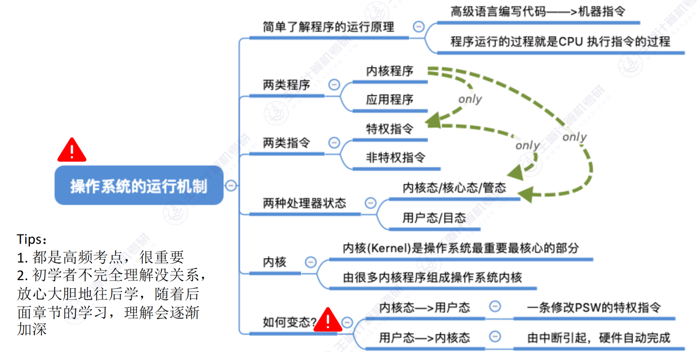

# 第一章：计算机系统概述

## 1.1 操作系统的基本概念

## 1.2 操作系统的发展与分类

## 1.3 操作系统运行环境

### 1.3.1 操作系统的运行机制

### 1.3.2 中断与异常

### 1.3.3 系统调用

## 1.4 操作系统结构

## 1.5 操作系统引导

## 1.6 虚拟机

# 第二章：进程与线程

## 2.1 进程与线程

### 2.1.1 2.1.2 进程的概念、组成与特征

### 2.1.3 线程的状态与转换

### 2.1.4 进程控制

### 2.1.5 进程通信

### 2.1.6 线程的概念与特点

## 2.2 CPU 调度

### 2.2.1 调度的概念、层次

### 2.2.4 进程调度的时机、切换与过程、方式

### 2.2.3 调度算法的评价指标

