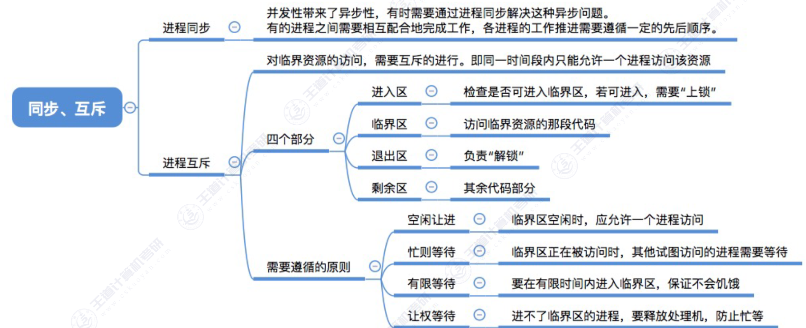
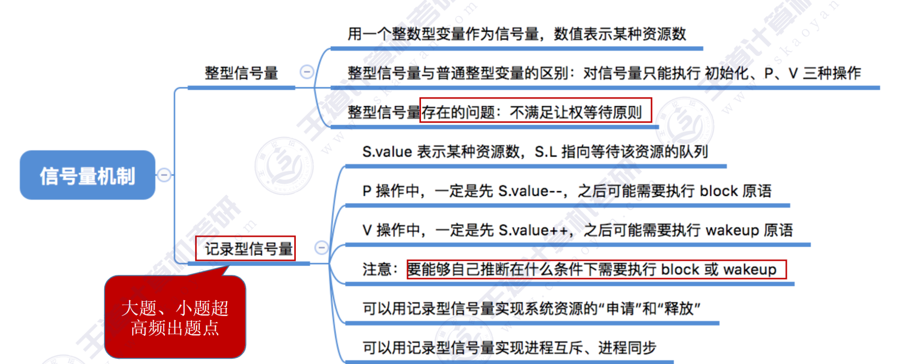

# 第一章：计算机系统概述

## 1.1 操作系统的基本概念

## 1.2 操作系统的发展与分类

## 1.3 操作系统运行环境

### 1.3.1 操作系统的运行机制

### 1.3.2 中断与异常

### 1.3.3 系统调用

## 1.4 操作系统结构

## 1.5 操作系统引导

## 1.6 虚拟机

# 第二章：进程与线程

## 2.1 进程与线程

### 2.1.1 2.1.2 进程的概念、组成与特征

### 2.1.3 线程的状态与转换

### 2.1.4 进程控制

### 2.1.5 进程通信

### 2.1.6 线程的概念与特点

## 2.2 CPU 调度

### 2.2.1 调度的概念、层次

### 2.2.4 进程调度的时机、切换与过程、方式

### 2.2.3 调度算法的评价指标

### 2.2.5 进程调度算法

#### 先来先服务算法

#### 短作业优先算法

#### 高响应比优先算法

#### 时间片轮转算法

#### 优先级调度算法

#### 多级反馈队列算法

#### 多级队列调度算法

### 2.2.6 多处理机调度

## 2.3 同步与互斥

### 2.3.1 同步和互斥的基本概念

### 2.3.2 进程控制的实现方法

### 2.3.3 互斥锁

### 2.3.4 信号量

### 2.3.5 信号量的典型问题

### 2.3.6 管程

## 2.4 死锁

### 2.4.1 死锁的概念

### 2.4.2 死锁的预防

### 2.4.3 死锁的避免

数据结构：
长度为 m 的一维数组 Available 表示还有多少可用资源
n _ m 矩阵 Max 表示各进程对资源的最大需求数
n _ m 矩阵 Allocation 表示已经给各进程分配了多少资源
Max – Allocation = Need 矩阵表示各进程最多还需要多少资源
用长度为 m 的一位数组 Request 表示进程此次申请的各种资源数
银行家算法步骤：
① 检查此次申请是否超过了之前声明的最大需求数
② 检查此时系统剩余的可用资源是否还能满足这次请求
③ 试探着分配，更改各数据结构
④ 用安全性算法检查此次分配是否会导致系统进入不安全状态
安全性算法步骤：
检查当前的剩余可用资源是否能满足某个进程的最大需求，如果可以，就把该进程加入安全序列，
并把该进程持有的资源全部回收。
不断重复上述过程，看最终是否能让所有进程都加入安全序列。
系统处于不安全状态未必死锁，但死锁时一定处于不安全状态。系统处于安全状态一定不会死锁。

### 2.4.4 死锁的检测与恢复

# 第三章：内存管理

## 3.1 内存管理概念

### 3.1.1 内存管理的基础知识

### 3.1.2 连续分配管理方式

### 3.1.3 分页管理方式

### 3.1.4 分段管理方式

### 3.1.5 段页式管理方式

## 3.2 虚拟内存管理

### 3.2.1 虚拟内存的基本概念

### 3.2.2 请求分页管理方式

### 3.2.4 页面置换算法

### 3.2.5 页面分配策略

### 3.2.6 内存映射文件

# 第四章：文件管理

## 4.1 文件系统基础

### 4.1.1 初识文件系统

### 4.1.2 文件的逻辑结构

### 4.1.3 文件目录

### 4.1.4 文件的物理结构

### 4.1.5 逻辑结构 VS 物理结构

### 4.1.6 文件存储空间管理

### 4.1.7 文件的基本操作

### 4.1.8 文件共享

### 4.1.9 文件保护

## 4.3 文件系统

### 4.3.1 文件系统的层次结构

### 4.3.2 文件系统布局

### 4.3.3 虚拟文件系统

