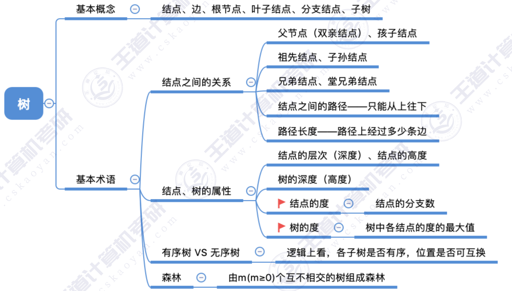
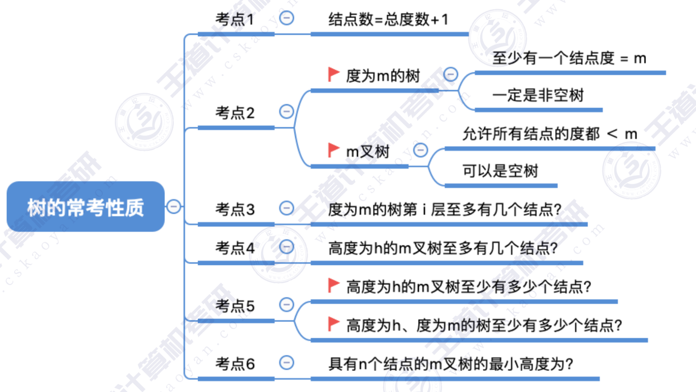

# 第一章：绪论

## 1.1 数据结构的基本概念

### 1.2_1 算法的基本概念

### 1.2_2 算法的时间复杂度

### 1.2_3 算法的空间复杂度

# 第二章：线性表

## 2.1 线性表的定义和基本操作

### 2.2_1 顺序表的定义

#### 2.2_1_1 顺序表的插入删除

#### 2.2_1_2 顺序表的查找

### 2.3.1 单链表的定义

### 2.3.2_1 单链表的插入删除

### 2.3.2_2 单链表的查找

### 2.3.2_3 单链表的建立

头插法、尾插法：核心就是初始化操作、指定结点的后插操作

### 2.3.3 双链表

### 2.3.4 循环链表

### 2.3.5 静态链表

### 2.3.6 顺序表和链表的比较

# 第三章：栈、队列和数组

### 3.1.1 栈的基本概念

### 3.1.2 栈的顺序存储实现

### 3.1.3 栈的链式存储实现

### 3.2.1 队列的基本概念

### 3.2.2 队列的顺序存储实现

### 3.2.3 队列的链式存储实现

### 3.2.4 双端队列

### 3.3.1 栈在括号匹配中的应用

用栈实现括号匹配：
依次扫描所有字符，遇到左括号入栈，遇到右括号则弹出栈顶元素检
查是否匹配。
匹配失败情况：
① 左括号单身 ② 右括号单身 ③ 左右括号不匹配

### 3.3.2 栈在表达式求值中的应用

### 3.3.3 栈在递归中的应用

函数调用的特点：最后被调用的函数最先执行结束
函数调用时，需要用一个“函数调用栈” 存储：
① 调用返回地址
② 实参
③ 局部变量

### 3.3.4 队列的应用

树的层次遍历
图的广度优先搜索
多个进程争抢着使用有限的系统资源时，FCFS（First Come First Service，先来先服务）是一种常用策略

## 3.4 数组和特殊矩阵

# 第四章：串

## 4.1 串的定义和实现

### 4.1.1 串的定义和基本操作

### 4.1.2 串的存储结构

## 4.2 串的模式匹配

### 4.2.1 朴素模式匹配算法

#### 4.2.2.1 KMP 算法

#### 4.2.2.2 手算 next 数组

### 4.2.3 KMP 算法的进一步优化

# 第五章：树与二叉树

## 5.1 树的基本概念

### 5.1.1 树的定义和基本术语

### 5.1.2 树的性质

## 5.2 二叉树的概念

#### 5.2.1_1 二叉树的定义和基本术语

#### 5.2.1_2 二叉树的性质

### 5.2.2 二叉树的存储结构

